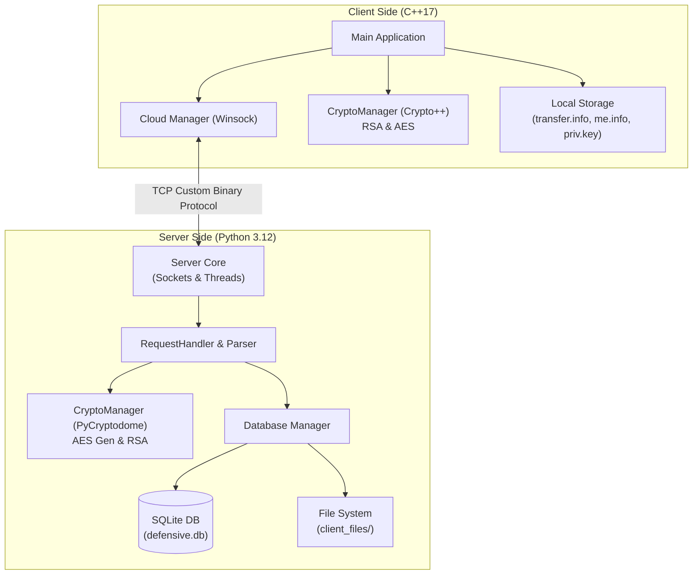
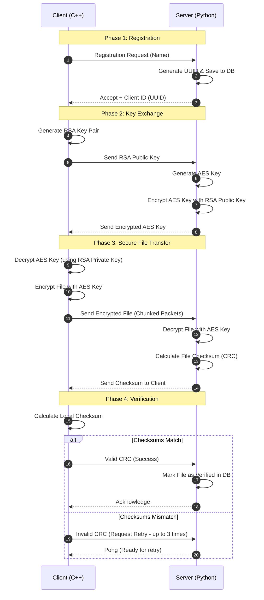

### Link to new version: https://github.com/RonB8/SecureFileComm-py

# SecureFileComm 🛡️


**SecureFileComm** is a robust Client-Server system enabling secure file storage and encrypted communication. Developed as part of the *Defensive Systems Programming* course, it features a C++ client and a Python server. 

The system ensures confidentiality and integrity by exchanging encryption keys using asymmetric cryptography (RSA) and transferring files via symmetric cryptography (AES), followed by strict checksum validations (CRC).

## ✨ Features

* **Client-Server Architecture:** Clients autonomously initiate communication, exchange encryption keys, and securely upload files to the server.
* **End-to-End Encryption:** * Asymmetric Encryption (RSA 1024-bit) for secure key exchange.
  * Symmetric Encryption (AES-CBC 256-bit) for fast and secure file transfer.
* **Data Integrity:** The server verifies file integrity using Checksum (CRC) validations. Re-transmission is automatically handled upon failure (up to 3 retries).
* **Multi-Client Support:** The server handles multiple clients concurrently using Python's `threading` module.
* **Persistent Database:** Utilizes an SQLite database (`defensive.db`) to store user information, encryption keys, and file metadata, allowing seamless recovery and reconnection.

## Component Architecture

## Sequence Diagram


## 🛠️ System Requirements

### Server
* **Language:** Python 3.12
* **Libraries:** `pycryptodome`
* **Operating System:** Cross-platform (Linux / Windows / macOS)

### Client
* **Language:** C++17
* **Environment:** Visual Studio 2022 (Windows recommended for testing)
* **Libraries:** `Crypto++` (CryptoPP), `winsock2`

## 🚀 Installation & Usage

### 1. Server Setup
Ensure Python 3.12 is installed, then install the required cryptographic library:
```bash
pip install pycryptodome
```

Create a port.info file in the same directory as the server code. It should contain the port number the server will listen on. If this file is missing, the server defaults to port 1256.

Example port.info:
```plaintext
1234
```
Run the server:
```bash
python main.py
```
### 2. Client Setup
1. Open the project in Visual Studio 2022 and ensure C++17 is enabled.

2. Link the Crypto++ library to your project.

3. Create a transfer.info file in the directory of the executable (.exe). This file contains the server connection details and the file you wish to send.

Example transfer.info:
```
127.0.0.1:1234
John Doe
my_secret_file.txt
```

Compile and run the client. The client will automatically register, exchange keys, and securely upload my_secret_file.txt.

## 🔄 Protocol Overview
The system uses a strict Little-Endian Binary Protocol over TCP.

1. **Registration (Request 825):** Clients register with a username and receive a unique 16-byte UUID.

2. **Public Key Exchange (Request 826):** Clients generate an RSA key pair and send their public key to the server. The server responds with an
   AES key encrypted via the client's RSA public key.

3. **File Transfer (Request 828):** Clients encrypt files using the AES key and transmit them in chunks.

4. **Validation (Request 900/901/902):** The server calculates the CRC of the decrypted file and verifies it against the client's expected CRC.

5. **Reconnection (Request 827):** Returning clients can bypass RSA generation by securely authenticating their existing UUID.

## 🗄️ Database Architecture
The Python server uses an SQLite database (defensive.db) containing two primary tables:

* **clients:** Stores ID (UUID), Name, PublicKey, LastSeen, and AESKey.

* **files:** Tracks uploaded files, associating them with the client's ID, FileName, PathName, and Verified status.

## 📜 License
This project was created for educational purposes as part of an academic curriculum.
